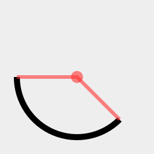
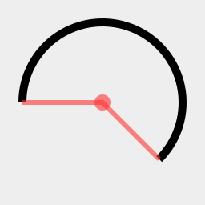
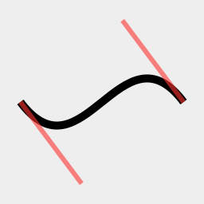
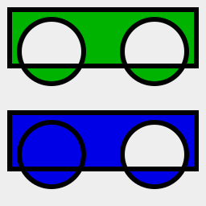
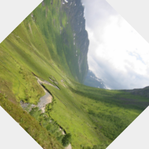
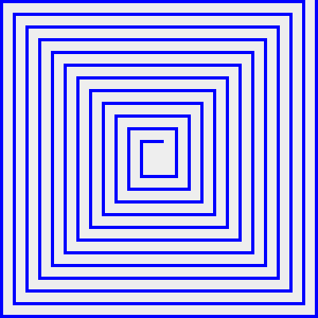
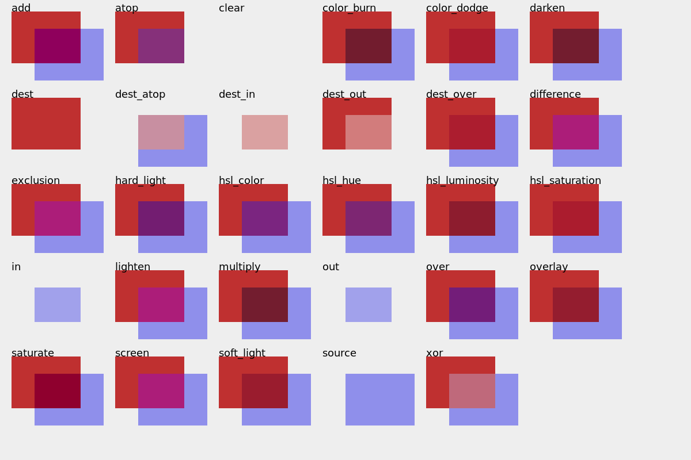
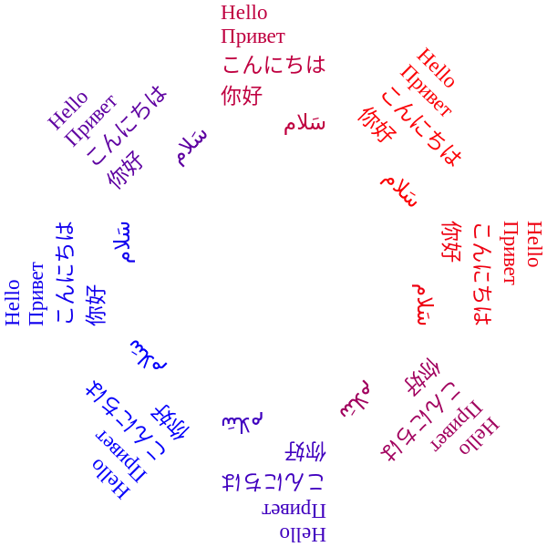

# zig-cairo

[](https://github.com/jackdbd/zig-cairo/actions/workflows/ci.yaml)

Thin wrapper for the [cairo](https://github.com/freedesktop/cairo) 2D graphics library.

Tested on Zig version **0.9.1**.

🚧 Very much a work in progress... 🚧

## Naming convention

As suggested in the [cairo Appendix](https://www.cairographics.org/manual/language-bindings.html), the type names and method names of the original C library were changed to follow the [Zig Style Guide](https://ziglang.org/documentation/0.7.1/#Names). For example, a method like `cairo_set_source(cr, source)` in cairo becomes `cr.setSource(source)` in zig-cairo.

## Installation

Clone the repo and jump into it:

```sh
git clone git@github.com:jackdbd/zig-cairo.git
cd zig-cairo
```

In order to use this library and run the examples you will need zig version **0.9.1**. You can get it using [zigup](https://github.com/marler8997/zigup):

```sh
zigup fetch 0.9.1
zigup 0.9.1
```

You will also need [cairo](https://www.cairographics.org/), [pango](https://gitlab.gnome.org/GNOME/pango), [pangocairo](https://docs.gtk.org/PangoCairo/), [xcb](https://xcb.freedesktop.org/), and [xvfb](https://www.x.org/releases/X11R7.6/doc/man/man1/Xvfb.1.xhtml) if you want to run some tests/examples in a virtual framebuffer. See [this script](./scripts/install-dependencies.sh).

## Examples

You can find many examples in the [examples directory](./examples/README.md).














Run `zig build --help` to see all the compilation targets.

Most examples generate a PNG. Here I use [feh](https://feh.finalrewind.org/) to view the generated file:

```sh
zig build rounded_rectangle && feh examples/generated/rounded_rectangle.png
zig build spirograph && feh examples/generated/spirograph.png
zig build text_extents && feh examples/generated/text_extents.png
```

A few examples generate a SVG:

```sh
zig build surface_svg && inkscape examples/generated/test-image.svg
```

Some other examples don't generate any image file. This one opens a window and renders cairo graphics inside of it (using a cairo [XCB](https://xcb.freedesktop.org/) surface):

```sh
zig build surface_xcb
```

If you installed [XVFB](https://www.x.org/releases/X11R7.6/doc/man/man1/Xvfb.1.xhtml) you can also run this example in a virtual framebuffer:

```sh
xvfb-run --server-args="-screen 0 1024x768x24" zig build surface_xcb
```

## Tests

```sh
# run all tests, in all modes (debug, release-fast, release-safe, release-small)
zig build test

# run all tests, only in debug mode
zig build test-debug
```
